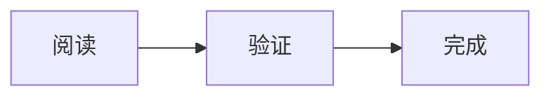

## 图片与加载失败


## 视频

<video id="playback-fixture" controls muted playsinline width="960" aria-label="原创视频播放测试"></video>
<p id="video-status">正在生成三秒原创测试视频。</p>
<script src="/notebook/fixture-video.js" defer></script>

<video controls preload="none" width="960" poster="/notebook/fixture.svg" aria-label="视频加载失败测试"><source src="/notebook/missing-video.mp4" type="video/mp4">浏览器不支持视频。</video>

第一个播放器使用浏览器生成的三秒几何动画验证真实播放；第二个保留失败源，验证资源失败状态。不涉及摄像头、麦克风或外部媒体。

## 宽表

| 项目 | 一月 | 二月 | 三月 | 四月 | 五月 | 六月 | 七月 | 八月 |
| --- | --- | --- | --- | --- | --- | --- | --- | --- |
| 本地验收样例 | 100 | 200 | 300 | 400 | 500 | 600 | 700 | 800 |

## 长代码

```javascript
const message = "This is an intentionally long original line for horizontal scrolling verification: abcdefghijklmnopqrstuvwxyz 0123456789 abcdefghijklmnopqrstuvwxyz 0123456789";
console.log(message);
```

## 公式与脚注

行内公式 $a^2+b^2=c^2$，参考脚注[^example]。

$$
E = mc^2
$$

[^example]: 原创脚注，可返回正文。

## 图表


